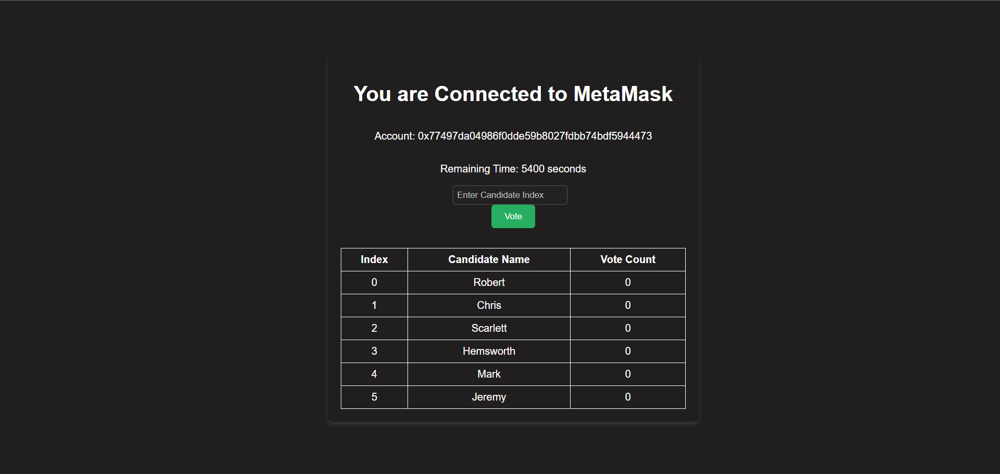

# 🗳️ Decentralized Voting Application

A secure, transparent, and tamper-proof voting system built on Ethereum using **Solidity**, **React.js**, and **MetaMask**. This DApp allows users to vote for candidates in a decentralized manner, ensuring each vote is recorded immutably on the blockchain.


## 🚀 Tech Stack

* **Frontend:** React.js, Tailwind CSS / Bootstrap
* **Smart Contract:** Solidity
* **Blockchain Interaction:** Ethers.js
* **Wallet Integration:** MetaMask
* **Local Blockchain:** Hardhat / Ganache (optional)
* **Deployment:** Vercel (Frontend) + Hardhat/Remix (Smart Contracts)

---

## 📦 Setup & Installation

### 1. Clone the Repository

```bash
git clone https://github.com/Akshay0920/Brainwave_Matrix_Intern.git
cd Brainwave_Matrix_Intern
```

### 2. Install Dependencies

#### For Smart Contracts

```bash
npm install --save-dev hardhat ethers
```

#### For Frontend

```bash
cd client
npm install
```

---

## 🔨 Compile & Deploy Smart Contract

### 1. Compile the Contract

```bash
npx hardhat compile
```

### 2. Deploy Locally

```bash
npx hardhat node
# In a new terminal
npx hardhat run scripts/deploy.js --network localhost
```

> Make sure MetaMask is connected to `http://127.0.0.1:8545`

---

## 🧪 Features

* ✅ Voter registration
* 🗳️ Secure vote casting (1 vote per account)
* 🔐 Tamper-proof recording on Ethereum
* 📊 Live voting results
* 🧠 Admin control (add/remove candidates, end election)
* 🔗 MetaMask integration

---

## 💡 How to Use

1. Start your app (`npm start` inside `client/`)
2. Connect your MetaMask wallet
3. Register and vote
4. Admin can end election to reveal results

---

## 📸 Screenshots

### 🔹 Screenshot 1


### 🔹 Screenshot 2

---


## 🙌 Acknowledgments

* [Ethereum.org](https://ethereum.org)
* [Hardhat](https://hardhat.org/)
* [Ethers.js](https://docs.ethers.org/)
* [MetaMask](https://metamask.io/)
